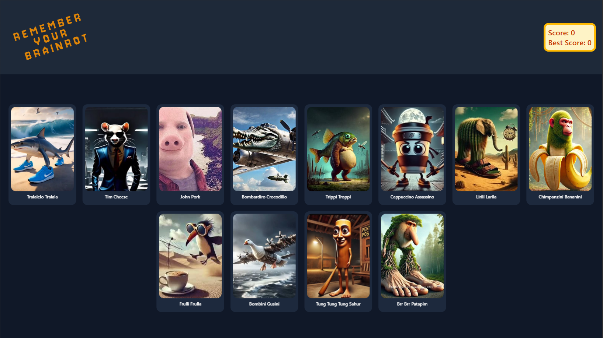

# Remember Your Brainrot



A memory card game featuring popular internet meme characters. Test your memory by clicking on different characters without repeating any selections. The goal is to click on all characters exactly once to achieve the perfect score.

## How to Play

1. Click on any character card to start the game
2. Remember which characters you have already clicked
3. Cards will shuffle after each selection
4. Avoid clicking the same character twice
5. Try to click all 12 characters to win the game
6. Your best score is automatically saved

## Features

- Interactive card game with smooth animations
- Score tracking with persistent best score
- Responsive design that works on all devices
- Shuffle animation after each card selection
- Win/lose detection with game over screen
- Restart functionality to play again

## Tech Stack

- **React 19** - Frontend framework
- **TypeScript** - Type safety and better development experience
- **Vite** - Fast build tool and development server
- **Zustand** - Lightweight state management
- **Tailwind CSS** - Utility-first CSS framework
- **React Parallax Tilt** - 3D tilt effect for cards
- **Motion** - Animation library

## Installation

1. Clone the repository

```bash
git clone <repository-url>
cd Remember-Your-Brainrot
```

2. Install dependencies

```bash
npm install
```

3. Start the development server

```bash
npm run dev
```

4. Build for production

```bash
npm run build
```

## Development

This project was built as part of The Odin Project curriculum to practice React concepts including:

- Component composition and state management
- Event handling and user interactions
- State management with Zustand
- TypeScript integration with React
- Modern CSS with Tailwind
- Build tooling with Vite

## License

This project is open source and available under the MIT License.
